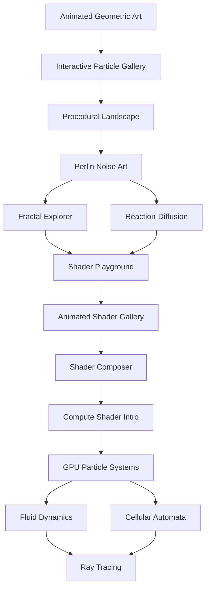

# Vue 3 + Three.js + WebGPU Digital Art Learning Curriculum

## Overview

This curriculum is designed for developers with strong Vue 3 skills who are new to Three.js, WebGPU, and shader programming. The focus is on creating digital art through hands-on projects, progressing from basic 3D concepts to advanced GPU computing and custom shaders.

## Learning Philosophy

- **Project-driven**: Each concept is taught through practical digital art projects
- **Progressive complexity**: Building from simple scenes to complex GPU-accelerated art
- **Visual feedback**: Immediate visual results to maintain engagement
- **Modular approach**: Each project can be extended or modified based on interest

## Curriculum Phases

### Phase 1: Foundation (4-6 weeks)
**Goal**: Establish Three.js fundamentals within Vue 3 architecture

#### Skills Developed
- [ ] Vue 3 + Three.js integration patterns
- [ ] Basic 3D scene setup and rendering
- [ ] Geometry, materials, and lighting fundamentals
- [ ] Animation and interactivity
- [ ] Asset loading and management

#### Project Timeline
- **Week 1-2**: Animated Geometric Art Studio
- **Week 3-4**: Interactive Particle Gallery
- **Week 5-6**: Procedural Landscape Generator

### Phase 2: Advanced Graphics (6-8 weeks)
**Goal**: Master advanced Three.js features and mathematical concepts for art

#### Skills Developed
- [ ] Advanced geometries and custom meshes
- [ ] Texture manipulation and UV mapping
- [ ] Post-processing effects
- [ ] Mathematical art concepts (noise, fractals)
- [ ] Performance optimization

#### Project Timeline
- **Week 1-2**: Perlin Noise Art Generator
- **Week 3-4**: Fractal Explorer
- **Week 5-6**: Reaction-Diffusion Simulator
- **Week 7-8**: Advanced Post-Processing Art Suite

### Phase 3: Shader Programming (6-8 weeks)
**Goal**: Create custom visual effects through shader programming

#### Skills Developed
- [ ] GLSL fundamentals (vertex and fragment shaders)
- [ ] Mathematical operations in shaders
- [ ] Uniform and attribute management
- [ ] Custom material creation
- [ ] Shader debugging techniques

#### Project Timeline
- **Week 1-2**: Shader Playground (basic effects)
- **Week 3-4**: Animated Shader Gallery
- **Week 5-6**: Interactive Shader Composer
- **Week 7-8**: Advanced Shader Art Collection

### Phase 4: WebGPU Computing (8-10 weeks)
**Goal**: Leverage GPU compute power for advanced digital art

#### Skills Developed
- [ ] WebGPU compute shader fundamentals
- [ ] Buffer management and data flow
- [ ] Parallel processing concepts
- [ ] Three.js + WebGPU integration
- [ ] Advanced simulation techniques

#### Project Timeline
- **Week 1-2**: Compute Shader Introduction
- **Week 3-4**: GPU-Accelerated Particle Systems
- **Week 5-6**: Fluid Dynamics Simulator
- **Week 7-8**: Cellular Automata Art
- **Week 9-10**: Ray Tracing Experiments

## Project Dependencies

## Prerequisites by Phase

### Phase 1 Prerequisites
- Strong Vue 3 composition API knowledge
- Basic JavaScript ES6+ features
- Understanding of HTML5 Canvas (helpful but not required)
- Basic trigonometry concepts

### Phase 2 Prerequisites
- Completed Phase 1 projects
- Comfort with mathematical concepts (vectors, matrices)
- Understanding of JavaScript modules and async programming

### Phase 3 Prerequisites
- Completed Phase 2 projects
- Basic understanding of graphics pipeline
- Willingness to learn mathematical concepts as needed

### Phase 4 Prerequisites
- Completed Phase 3 projects
- Understanding of parallel computing concepts
- Comfort with advanced JavaScript and GPU concepts

## Skills Assessment Framework

### Technical Skills Tracking

#### Vue 3 Integration (Pre-existing)
- [x] Composition API mastery
- [x] Reactive state management
- [x] Component architecture
- [x] Lifecycle management

#### Three.js Core (Phase 1)
- [ ] Scene, camera, renderer setup
- [ ] Geometry and material basics
- [ ] Lighting and shadows
- [ ] Animation loops
- [ ] Asset loading
- [ ] Event handling

#### Mathematical Concepts (Phase 2)
- [ ] Vector mathematics
- [ ] Matrix transformations
- [ ] Noise functions
- [ ] Fractal geometry
- [ ] Color theory
- [ ] UV coordinate systems

#### Shader Programming (Phase 3)
- [ ] GLSL syntax and structure
- [ ] Vertex shader concepts
- [ ] Fragment shader concepts
- [ ] Uniform variables
- [ ] Texture sampling
- [ ] Mathematical functions in shaders

#### WebGPU Computing (Phase 4)
- [ ] Compute shader basics
- [ ] Buffer operations
- [ ] Workgroup concepts
- [ ] Memory management
- [ ] Synchronization
- [ ] Pipeline optimization

## Customization Guidelines

### For Visual Arts Focus
- Emphasize color theory and composition
- Include more abstract and generative art projects
- Add projects focusing on visual storytelling

### For Technical Focus
- Include performance profiling projects
- Add advanced optimization techniques
- Emphasize debugging and development tools

### For Mathematical Focus
- Include deeper mathematical theory
- Add projects exploring mathematical visualizations
- Emphasize algorithm implementation

## Progress Milestones

### Foundation Milestone (End of Phase 1)
Student can create a complete Vue 3 application with Three.js that includes:
- Interactive 3D scenes
- Animated elements
- User controls
- Asset loading
- Basic lighting and materials

### Intermediate Milestone (End of Phase 2)
Student can create complex mathematical visualizations including:
- Procedural generation techniques
- Advanced geometric manipulations
- Post-processing effects
- Performance-optimized scenes

### Advanced Milestone (End of Phase 3)
Student can write custom shaders for:
- Unique visual effects
- Interactive materials
- Mathematical visualizations
- Optimized rendering techniques

### Expert Milestone (End of Phase 4)
Student can implement GPU compute solutions for:
- Complex simulations
- Real-time processing
- Advanced art generation
- Optimized parallel algorithms

## Resource Requirements

### Development Environment
- Node.js 18+ with npm/yarn
- Vue 3 CLI or Vite
- Modern browser with WebGL 2.0 and WebGPU support
- Code editor with GLSL syntax highlighting

### Hardware Recommendations
- Dedicated GPU (recommended for Phase 4)
- 8GB+ RAM
- Modern CPU for development builds

### External Resources
- Three.js documentation
- WebGPU specifications
- GLSL reference materials
- Mathematical visualization resources

## Assessment Methods

### Project-Based Assessment
- Each project includes specific deliverables
- Code quality and organization evaluation
- Creative and technical innovation scoring
- Performance optimization assessment

### Skill Demonstrations
- Live coding sessions
- Problem-solving challenges
- Code review and explanation
- Teaching-back sessions

### Portfolio Development
- Building a comprehensive portfolio
- Documentation and presentation skills
- Technical writing and explanation
- Creative project showcase

## Adaptation Strategies

### For Different Learning Speeds
- **Fast learners**: Additional challenge projects and extensions
- **Slower pace**: Break projects into smaller milestones
- **Deep dive**: Focus on fewer projects with more depth

### For Different Interests
- **Art focus**: Emphasize visual creativity and composition
- **Technical focus**: Deep dive into optimization and algorithms
- **Mathematical focus**: Explore underlying mathematical concepts

### For Different Time Commitments
- **Full-time**: Complete curriculum in 6-8 months
- **Part-time**: Extended timeline with weekend projects
- **Casual**: Pick specific projects of interest

## Success Metrics

### Quantitative Measures
- Projects completed per phase
- Code quality scores
- Performance benchmarks achieved
- Portfolio pieces created

### Qualitative Measures
- Understanding of concepts demonstrated
- Creative problem-solving approach
- Code organization and maintainability
- Ability to explain and teach concepts

## Next Steps After Curriculum

### Advanced Topics
- Machine learning integration (TensorFlow.js)
- Virtual/Augmented Reality (WebXR)
- Advanced physics simulations
- Real-time multiplayer art experiences

### Specialization Paths
- **Generative Art**: Focus on algorithmic art creation
- **Interactive Installations**: Large-scale interactive projects
- **Game Development**: Transition to game development
- **Scientific Visualization**: Data visualization and simulation

### Community Engagement
- Contributing to open source projects
- Sharing knowledge through tutorials
- Participating in digital art communities
- Mentoring other learners